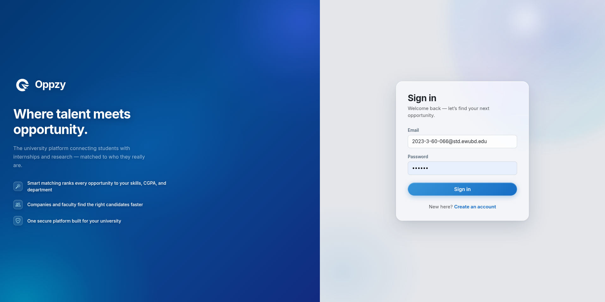
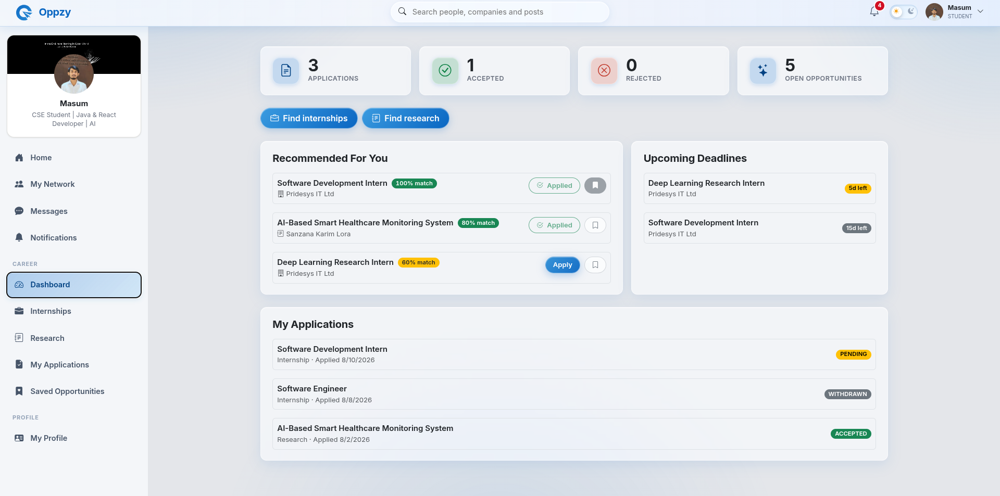

# Oppzy — Internship & Research Matching Platform

 

Oppzy is a university-focused full-stack platform that connects students with relevant **internship and research opportunities**. It supports Students, Companies, Faculty members, and Administrators through role-based dashboards, secure authentication, opportunity management, applications, and profile-based matching.

---

## Main Features

- **Student:** profile management, skills, projects, certifications, opportunity recommendations, applications, bookmarks, and dashboard.
- **Company:** company profile, internship creation and management, applicant review, and application decisions.
- **Faculty:** faculty profile, research opportunity creation and management, applicant review, and research application decisions.
- **Admin:** user management, block/unblock users, reporting, and platform monitoring.
- **Security:** Spring Security, JWT access tokens, refresh tokens, and role-based authorization.
- **Matching:** opportunities are ranked using skills, CGPA, and department compatibility.

---
 

## Technology Stack

| Layer | Technologies |
|---|---|
| Frontend | React 18, Vite, React Router, Axios, Bootstrap 5, Recharts |
| Backend | Java 17, Spring Boot 3.3.5, Spring Security, Spring Data JPA |
| Database | MySQL 8 |
| Authentication | JWT Access Token + Refresh Token |
| ORM | Hibernate |
| API Documentation | Swagger |
| Containerization | Docker, Docker Compose |
| Web Server | Nginx |
| Build Tools | Maven, npm |

---

# Run the Full Project with Docker

## Prerequisites

- Docker
- Docker Compose v2
- Git

Check:

```bash
docker --version
docker compose version
```

## 1. Clone the Repository

```bash
git clone https://github.com/masum-mir/Oppzy.git
cd Oppzy
```

## 2. Create Environment File

```bash
cp .env.example .env
```

Example:

```env
FRONTEND_PORT=3000
BACKEND_PORT=8080
MYSQL_HOST_PORT=3307

MYSQL_DATABASE=oppzy
MYSQL_ROOT_PASSWORD=change_this_root_password

DB_USERNAME=oppzy
DB_PASSWORD=change_this_database_password

JWT_SECRET=replace_with_a_long_random_secret_of_at_least_32_characters
JWT_ACCESS_EXPIRATION_MS=900000
JWT_REFRESH_EXPIRATION_MS=604800000

CORS_ORIGINS=http://localhost:3000,http://localhost:5173

ADMIN_EMAIL=admin@ewubd.edu
ADMIN_PASSWORD=change_this_admin_password
``` 

## 3. Build and Start

```bash
docker compose up --build -d
```

## 4. Access the Application

| Service | Address |
|---|---|
| Frontend | `http://localhost:3000` |
| Backend | `http://localhost:8080` |
| API Base | `http://localhost:8080/api` |
| Swagger UI | `http://localhost:8080/swagger-ui.html` |
| MySQL from Host | `localhost:3307` |
| MySQL inside Docker | `mysql:3306` |

## 5. Stop the Project

```bash
docker compose down
```

This keeps the MySQL data volume.

To intentionally remove the database volume:

```bash
docker compose down -v
```

---

## Docker Request Flow

```text
Browser
   ↓
React + Nginx
localhost:3000
   ↓ /api
Spring Boot
backend:8080
   ↓
MySQL
mysql:3306
```

---

## Application Preview

### Sign In

<p align="center">
  
</p>

### Student Dashboard

<p align="center">
  
</p>

---

## Faculty Information
 ```text
Course: CSE347 - Information System Analysis and Design
Section: 08
Instructor: Sanzana Karim Lora, Lecturer, Dept of CSE
Institution: East West University
Email: `sanzana.lora@ewubd.edu`
Submission Date: Augest 17, 2026
``` 

---

## Repository

```text
https://github.com/masum-mir/Oppzy.git
```
 

## More Documentation

- Backend setup and backend structure: `backend/README.md`
- Frontend setup and frontend structure: `frontend/README.md`

---
 
